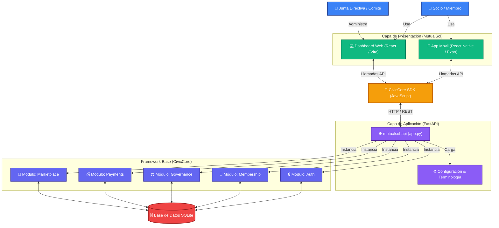

# Arquitectura del Sistema: MutualSol & CivicCore

Este documento ilustra la arquitectura de alto nivel de MutualSol, destacando cómo la aplicación cliente se construye sobre el framework subyacente de CivicCore.

## Diagrama de Interacciones

## Componentes Principales

1. **Capa de Presentación (Frontend):**
   - **App Móvil (React Native):** Orientada a la experiencia del socio individual (solicitar créditos, votar en asambleas, realizar aportes, ver su mercado).
   - **Dashboard Web (React):** Orientada a la administración y comités (aprobar créditos, revisar configuración de salida/fusión, ver estadísticas globales).

2. **Capa de Comunicación:**
   - **CivicCore SDK:** Un paquete centralizado de JavaScript (`api.js`) que contiene todas las funciones de red (`fetch`). Garantiza que tanto la App como la Web se comuniquen con el backend usando las mismas reglas y endpoints.

3. **Capa de Aplicación (Backend de Instancia):**
   - **mutualsol-api (`app.py`):** Es la implementación específica para MutualSol. Aquí se define la personalización de la organización (ej. terminología de UI) y se importan los módulos genéricos que se requieran.

4. **Framework Base (CivicCore):**
   - **Módulos Independientes:** El corazón del sistema. Cada módulo (`auth`, `membership`, `governance`, `payments`, etc.) es agnóstico y contiene su propia lógica de negocios, modelos de base de datos (`models.py`), esquemas Pydantic y rutas (`router.py`). MutualSol solo "enciende" los que necesita.

5. **Capa de Persistencia:**
   - **Base de Datos (SQLite):** Almacena todo el estado de la aplicación. Utiliza SQLAlchemy como ORM.
